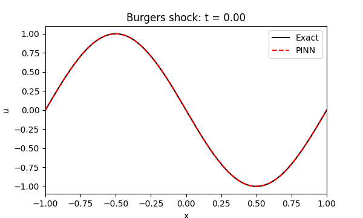
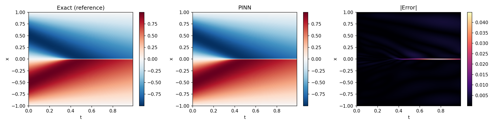

# Burgers-PINN
A PINN that learns the viscous Burgers' equation, including a sharp shock, without seeing any solution data during training. Written in pure PyTorch.

**u_t + u·u_x = ν·u_xx**, ν = 0.01/π, x ∈ [-1, 1], t ∈ [0, 1]
IC: u(x,0) = -sin(πx) | BC: u(±1, t) = 0

## Result
Validated against the high-accuracy reference solution from [Raissi's PINNs repo](https://github.com/maziarraissi/PINNs) (256 × 100 grid).

| Stage | Relative L2 error |
|---|---|
| Adam, 10k steps (uniform points) | 0.075 |
| + L-BFGS only (stopped after 18 evaluations, no gain) | 0.075 |
| + residual-based adaptive refinement (RAR) + Adam fine-tuning | ~0.02 |
| + L-BFGS polish (final) | **0.0045** |

Away from the shock (|x| > 0.05) the error is 0.0025. Max pointwise error is 0.045, located on the shock line.

## Method
- **Network:** MLP, 8 hidden layers × 20 neurons, tanh, Xavier init (3,021 parameters).
- **Loss:** `1·PDE + 20·IC + 20·BC` (mean squared errors). The PDE residual `u_t + u·u_x − ν·u_xx` is computed with autograd (`create_graph=True`).
- **Points:** 10,000 random interior, 200 initial, 200 per wall. RAR then adds the 5,000 worst-residual points from 50,000 random candidates, so the training set concentrates at the shock (mean |x| of new points = 0.18 vs 0.5 uniform).
- **Training:** Adam (lr 1e-3, decayed) → RAR → Adam (lr 5e-4, then decayed) → L-BFGS.
- **Reproducibility:** `torch.manual_seed(0)`. A full rerun on CPU reproduced every printed number.

## Note
- The shock is the hard part: uniform sampling puts ~1% of points in it, so plain Adam and L-BFGS both stalled at 7.5% error.
- Pointwise error at a shock is dominated by tiny position shifts, so max error alone is misleading. I report relL2 and off-shock error too.
- RAR (like adaptive mesh refinement in CFD) fixed it by placing points where the residual was large. After that, L-BFGS became useful (1083 evaluations, vs 18 before).
- A freshly restarted Adam optimizer kicks a good model; use a small lr for fine-tuning.
- Untrained networks give a near-zero PDE residual (constant solution), so residual alone is not a success measure. Validate against the reference.

## Limitations
- The loss curve logs Adam only; the L-BFGS polish is not plotted.
- L-BFGS used 1083 of ~1250 allowed evaluations, so it may not be fully converged.
- Training uses t ∈ [0, 1]; the reference grid ends at t = 0.99.

## Run
Open `Burgers-PINN.ipynb` in Google Colab and run the cells in order (CPU works but is slow; a T4 GPU is faster).
